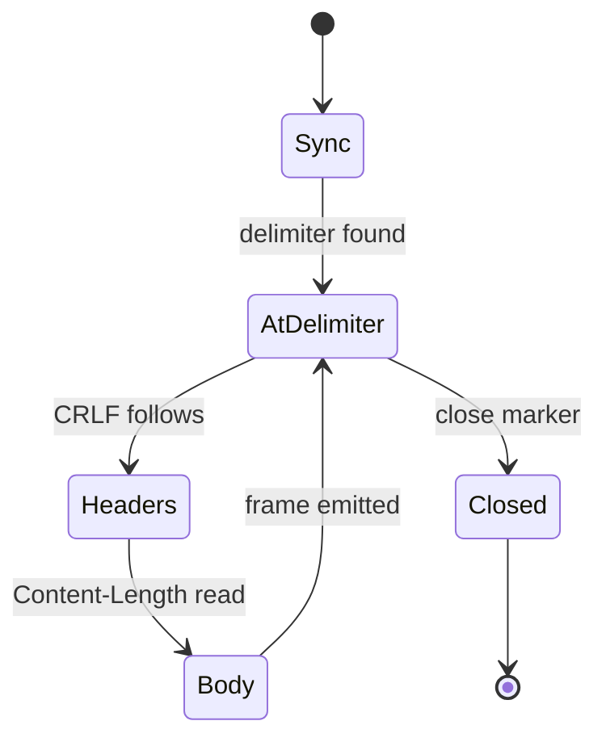

# streaming-multipart-audio

[](https://github.com/davorrr/streaming-multipart-audio/actions/workflows/ci.yml)

An incremental `multipart/mixed` parser and gapless Web Audio player for a server that streams
audio **while it is still generating it** — frames arriving out of order, at irregular intervals,
cut at arbitrary byte offsets by the network.

No dependencies. TypeScript. `npm test` and `npm run demo` work from a clean clone.

---

## The problem

A voice assistant that waits for the full reply before speaking leaves the user staring at silence
for several seconds. The fix is to synthesise sentence by sentence and ship each piece the moment
it exists. That turns one response into a stream of frames on a `multipart/mixed` body:

```http
HTTP/1.1 200 OK
Content-Type: multipart/mixed; boundary=chat

--chat
Content-Type: application/json
Content-Length: 48

{"transcript":"what time do you close?","response":null}
--chat
Content-Type: audio/wav
X-Chunk-Index: 0
Content-Length: 15404

<15404 bytes of WAV>
--chat
Content-Type: audio/wav
X-Chunk-Index: 2          ← index 1 is still being synthesised
Content-Length: 15404

<15404 bytes of WAV>
--chat--
```

The client has to turn that back into continuous speech. Three things make it harder than it looks.

**The network does not deliver frames.** It delivers bytes. A read can end halfway through a header
block, halfway through a WAV body, or exactly on the seam between them. Nothing may be emitted until
a whole frame is present, and everything left over has to stay buffered for the next read.

**The payload is binary, and it can contain the delimiter.** A parser that scans for `--chat` to
find frame boundaries will eventually find one inside a WAV body and tear a frame in half. Audio is
arbitrary bytes; sooner or later it contains any given sequence.

**Frames are produced out of order.** Synthesis is fanned out across workers, so chunk 4 can finish
before chunk 2. Something has to put them back in sequence before they are played, because audio in
the wrong order is worse than audio that is late — it is confidently wrong.

---

## Run it

```bash
npm install
npm test        # 37 tests, no browser required
npm run demo    # http://localhost:8080
npm run demo:cli
```

The demo server deliberately misbehaves: it shuffles frame order, inserts random gaps, and writes
each frame in random-sized pieces so header blocks and bodies get torn across reads. Every audio
frame is one note of a scale, so **a reordering bug is audible** — untick *reassemble in index
order* in the browser demo and the scale comes out scrambled.

`npm run demo:cli` runs the same thing headless over a real socket:

```
  GET /voice?chunks=8&shuffle=1&jitter=1&split=1
  server sends frames out of order, with gaps, cut at random byte offsets

  metadata   transcript: Here is a scale, one note per frame, streamed as it is produced.
  first audio ready after 1326 ms

  arrival order (off the wire)
  ─────────────────────────────────────────────
   index      at       bytes   parser
   4        498 ms    15404   buffered, out of order
   6        908 ms    15404   buffered, out of order
   0       1339 ms    15404   released immediately
   3       1834 ms    15404   buffered, out of order
   ...

  wire order   4 6 0 3 2 5 7 1
  play order   0 1 2 3 4 5 6 7   ✓ in order

  8 audio frames, 6 arrived early and were buffered, 0 skipped
  time to first audio 1326 ms, stream closed cleanly: true, 0 bytes left over
```

---

## Using it

```ts
import { VoiceStreamClient, WebAudioSink } from 'streaming-multipart-audio';

const sink = new WebAudioSink({ onFirstAudio: () => showStopButton() });
const client = new VoiceStreamClient({ sink });

client.on('metadata', ({ transcript, response }) => render(transcript, response));

const stats = await client.consumeResponse(await fetch('/voice', { method: 'POST', body }));
// stats.timeToFirstAudioMs, stats.reordered, stats.skipped, stats.closedCleanly

stopButton.onclick = () => client.stop();   // barge-in
```

The parser is usable on its own, against any byte source:

```ts
const parser = MultipartStreamParser.fromContentType(response.headers.get('content-type'));

for await (const bytes of response.body) {
  for (const part of parser.push(bytes)) {
    handle(part.headers, part.body);   // only ever whole frames
  }
}
parser.end();
```

---

## What is in here

| Module | Responsibility |
| --- | --- |
| `MultipartStreamParser` | Bytes in, whole frames out. Transport-agnostic, no DOM, no audio. |
| `ChunkReassembler` | Restores index order, with a bounded tolerance for a frame that never arrives. |
| `WebAudioSink` | Gapless playback by absolute scheduling on the audio clock, plus barge-in. |
| `VoiceStreamClient` | Composes the three and reports what happened. |
| `ByteQueue` | Growable buffer with a read cursor, so appends and consumes are amortised O(1). |

The split is what makes the interesting half testable. Parsing and ordering are pure byte and
integer work with no audio stack involved, so the entire protocol layer is exercised in Node.

---

## Wire format

The container is standard `multipart/mixed` (RFC 2046 §5.1.3). The profile is not: every part
carries `Content-Length`, and ordering is expressed by an application-defined header. This section
is normative enough to write a server against without reading the source.

```abnf
stream        = [preamble CRLF] 1*frame close
frame         = delimiter CRLF header-block CRLF body CRLF
close         = delimiter "--" [CRLF]

delimiter     = "--" boundary        ; only at stream start, or directly after CRLF
header-block  = 1*(field-name ":" [SP] field-value CRLF)
body          = <exactly Content-Length octets, any values whatsoever>
```

`boundary` is read from the response header, not hardcoded:
`Content-Type: multipart/mixed; boundary=chat`.

### Headers

| Header | Required | Meaning |
| --- | --- | --- |
| `Content-Length` | **yes** | Exact octet count of the body. Nothing is emitted until this many bytes are buffered. |
| `Content-Type` | no | Dispatch. `application/json` is metadata, `audio/*` is an audio frame. Absent or anything else is counted as ignored, never fatal. |
| `X-Chunk-Index` | no | Zero-based production sequence number. Absent, frames play in arrival order. |

Header names are case-insensitive; a value may contain colons; on a repeated name the last wins.

### What a conforming parser rejects

Silently resyncing on a malformed stream is how you end up playing half a frame of noise, so these
are hard errors rather than recoveries:

- a delimiter that is neither at offset 0 nor preceded by CRLF is not a delimiter
- once anchored, a buffer not starting at a delimiter — the framing is lost, not recoverable
- a delimiter followed by neither CRLF nor the close marker
- `Content-Length` missing, non-integer, or negative
- a header block exceeding `maxHeaderBytes` with no terminator
- a body not followed by CRLF, mid-stream

One deliberate tolerance: the trailing CRLF may be **omitted on the final frame** at end of stream.
Real servers do this, including the one this was extracted from.

### Parser states

The happy path is drawn; the stalls are not. Every state can also run out of bytes, in which case
the parser retains the remainder, returns to the caller, and resumes in the same state on the next
`push`. That case is the normal one rather than the exception — it is what *incremental* means here.



After the first anchor the parser never searches for a delimiter again. `Body -> AtDelimiter`
consumes exactly `Content-Length + 2` bytes, which leaves the buffer starting on the next
delimiter by construction. That invariant is what makes a frame body containing a byte-perfect
copy of the delimiter a non-event.

---

## Design decisions

**Bodies are length-delimited, not delimiter-scanned.** Every part must carry `Content-Length`.
RFC 2046 multipart finds the end of a part by scanning for the next delimiter, which is why it
needs a delimiter the payload is unlikely to contain — a bet that gets worse the more binary data
you send. Here the parser reads the length, skips exactly that many bytes, and is finished. A body
may contain a byte-perfect copy of the delimiter, CRLF prefix included, and it is still just body.
It is also O(1) per frame rather than O(body), which matters when a 15 KB body would otherwise be
rescanned on every network read.

**The parser anchors once, then never searches again.** The first delimiter is found by scanning —
only at offset 0 or immediately after a CRLF, so raw delimiter bytes in a preamble cannot match.
After that the parser holds the invariant that the buffer starts exactly at a delimiter, and every
subsequent frame is located arithmetically. Losing that invariant is a hard error rather than a
resync, because silently resyncing on a corrupt stream is how you play half a frame of noise.

**Playback is scheduled on the audio clock, not chained on callbacks.** Each frame starts at an
explicit time — the running end of the previous one — so the next buffer is queued inside the audio
thread before the current one ends. Starting the next frame from the previous one's `onended`
instead means crossing into the main thread and waiting for the event loop, which at sentence-sized
frames is an audible stutter between every chunk.

**Reordering belongs on the client, not the server.** The system this came from fanned synthesis
across eight workers and then re-ordered the results *before* writing them, so frames left the
server already in sequence and `X-Chunk-Index` was belt and braces. That is a defensible choice and
it is not wrong. It does mean the server holds every early-finishing frame in memory until the
straggler ahead of it is done, and then writes them all as one burst.

The same bytes cross the wire either way — what changes is *when*. Emitting frames as they finish
spreads the transfer across the synthesis window instead of bursting it immediately after the slow
chunk, so by the time playback reaches the tail of a reply the tail is already on the device and no
longer depends on the network at all. On a good connection this is a wash. On a bad one, the burst
lands exactly as playback is starting, which is the worst available moment for it. The server also
stops holding per-request buffers that scale with fan-out times concurrency.

**A missing frame is abandoned, not waited for.** If frames pile up behind a gap past
`maxPending`, the reassembler gives up on the missing index and drains. A dropped frame should cost
you a word, not the rest of the reply.

**Barge-in does not tear down the AudioContext.** Stopping means stopping the scheduled sources and
invalidating work still in the decode chain. Closing the context would discard the unlock earned
from the user gesture, and on iOS the next reply is then silent until the user taps again.

**Playback lives behind an interface.** `AudioSink` is two methods. `WebAudioSink` implements it for
the browser, `RecordingSink` implements it for tests, and a platform with no Web Audio implements it
with whatever it does have.

The React Native build of this pipeline is the example. It ran the same parser and the same frames,
and differed only in the sink — it wrote each frame to a cache file and handed the path to the
system player. Sketched against this interface, that is:

```ts
// Shape of the React Native sink, for illustration. Not shipped here: it needs
// the platform packages, so it cannot run in CI or in the demo.
class ReactNativeFileSink implements AudioSink {
  #queue: string[] = [];
  #playing = false;
  #sound: Sound | null = null;

  async enqueue(frame: AudioFrame): Promise<void> {
    const file = `${Date.now()}_${frame.index}.aac`;
    const path = `${RNFS.CachesDirectoryPath}/${file}`;
    await RNFS.writeFile(path, Buffer.from(frame.bytes).toString('base64'), 'base64');
    this.#queue.push(path);
    this.#playNext();
  }

  #playNext(): void {
    if (this.#playing || this.#queue.length === 0) return;
    const path = this.#queue.shift()!;
    this.#playing = true;

    this.#sound = new Sound(basename(path), RNFS.CachesDirectoryPath, () => {
      this.#sound!.play(() => {
        this.#sound!.release();
        RNFS.unlink(path).catch(() => {});
        this.#playing = false;
        this.#playNext();   // ← the next frame only starts loading once this one ends
      });
    });
  }

  stop(): void {
    this.#queue.length = 0;
    this.#sound?.stop();
    this.#sound?.release();
    this.#sound = null;
  }
}
```

Worth being clear about what that costs, because it is the same structural mistake `WebAudioSink`
avoids: the next frame is not touched until the current one has finished playing, so every frame
boundary pays a file read plus a player initialisation. It is sequential, not gapless. A platform
that cannot schedule against an audio clock cannot fully fix this, but it can get most of the way
by decoding one frame ahead rather than starting from cold at each boundary.

---

## Tests

37 tests, `node:test`, no browser and no test framework.

The one that matters most asserts the property that actually defines an incremental parser: **the
output must not depend on where the network cut the stream.** The same bytes are fed in every
possible two-way split, and again at every fixed read size down to one byte at a time, and every run
has to produce byte-identical frames.

The rest cover the cases that bite in production rather than the happy path:

- a body containing a byte-perfect copy of the delimiter, CRLF prefix and all, survives intact
- a header terminator landing exactly on the last byte of a read is detected, not stalled
- the closing delimiter parses with or without its trailing CRLF, because a real server sent it both ways
- a truncated stream reports itself as truncated instead of looking clean
- frame bodies stay valid after later reads have reused the backing buffer
- an unterminated header block is bounded rather than buffered forever
- a permanently missing index is abandoned so playback continues
- a malformed metadata frame does not take the audio down with it
- barge-in mid-stream stops delivery, including the frame in flight

---

## Provenance

Extracted from the client half of a streaming voice pipeline I built and operated in production —
a creator-AI platform where a GPU text-to-speech service synthesised replies sentence by sentence
and streamed them to a web app and a React Native app. The full system is closed-source and stays
that way; this repo is the transport and playback layer, rewritten standalone.

The two original clients were independent implementations of the same protocol, and each was better
at a different half. This code takes the strict framing from the mobile one — requiring the trailing
CRLF before treating a body as complete, and defaulting a missing `Content-Type` instead of throwing
on it — and the ordering from the web one, which was the only side with a reorder buffer at all.

Both already read the boundary out of the response header, which is why `fromContentType` is a
first-class constructor here rather than an afterthought: the same parser was pointed at more than
one server endpoint, and the endpoints did not agree with each other about audio encoding.

Both of their bugs are fixed here, and each fix has a test:

- `findDoubleCRLF` scanned with `i < len - 3`, so it could not see a header terminator whose last
  byte was the last byte available. A read landing on the header/body seam stalled the frame until
  more bytes arrived, and hung outright if none ever did.
- The mobile parser applied its boundary offset twice — it shifted the buffer to the boundary and
  then kept adding the old offset — which produced garbage headers whenever the boundary was not
  already at offset 0.
- The closing delimiter was matched as `--chat--\r\n` while the server actually sent a bare
  `--chat--`, so the clean-close path never ran in production. End-of-stream covered for it.
- The web client threw on any part that omitted `Content-Type`, because the header was indexed
  unguarded. The mobile one already defaulted it.
- The web client matched `audio/wav` exactly, with no fallback branch. It was pointed at two server
  endpoints, and the other one encoded as AAC — so every audio frame from that endpoint fell past
  both branches and was discarded in silence. The transcript still rendered; the reply just made no
  sound. Matching `audio/*` and counting anything unhandled, rather than dropping it, is the fix.
- Both hardcoded a skip for 10000-byte bodies, working around a dummy all-zero frame the server
  emitted. That is a server bug patched twice on the client; it is not in here.
- Neither had tests.

State was module-level in both, so only one stream could be in flight at a time and each new call
began by hand-resetting a dozen globals. Everything here is instance state.

---

## Limitations

- `Content-Length` is required on every part. This is a length-delimited profile of
  `multipart/mixed`, not a general RFC 2046 parser, and it will not read a stream that omits it.
- `WebAudioSink` decodes with `decodeAudioData`, so frames must be self-contained encoded files —
  a WAV or AAC per frame, not a split of one continuous encoded stream.
- No retry or resumption. A dropped connection ends the reply; recovering it is the caller's
  business.
- Frames are assumed to be indexed from 0 with no negative indices.

## License

MIT
